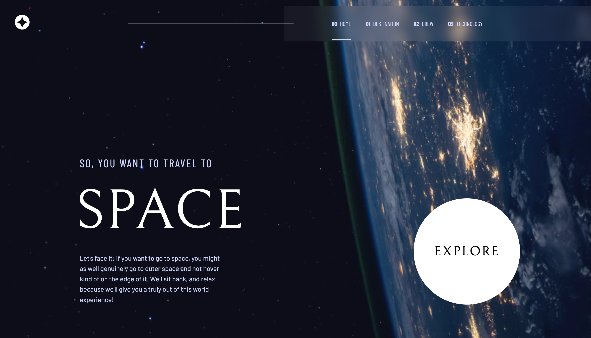

# Frontend Mentor - Space tourism website solution

This is a solution to the [Space tourism website challenge on Frontend Mentor](https://www.frontendmentor.io/challenges/space-tourism-multipage-website-gRWj1URZ3). Frontend Mentor challenges help you improve your coding skills by building realistic projects.

## Table of contents

- [Overview](#overview)
  - [The challenge](#the-challenge)
  - [Screenshot](#screenshot)
  - [Links](#links)
- [My process](#my-process)
  - [Built with](#built-with)
  - [Useful resources](#useful-resources)
- [Author](#author)

## Overview

### The challenge

Users should be able to:

- View the optimal layout for each of the website's pages depending on their device's screen size
- See hover states for all interactive elements on the page
- View each page and be able to toggle between the tabs to see new information

### Screenshot

### Links

- Solution URL: [Solution](https://www.frontendmentor.io/solutions/space-tourism-multi-page-website-K2TOm0mPzR)
- Live Site URL: [Live site](https://garciajr-space-tourism.netlify.app/)

## My process

### Built with

- Semantic HTML5 markup
- Mobile-first workflow
- [React](https://reactjs.org/) - JS library
- [React Router](https://reactrouter.com/en/main) - Library for routing in react
- [TailwindCSS](https://tailwindcss.com/) - CSS framework

### Useful resources

- [w3schools](https://www.w3schools.com/react/react_router.asp) - This helped me understand/how to use react router.

## Author

- Frontend Mentor - [@Garcia-Jr](https://www.frontendmentor.io/profile/Garcia-Jr)
